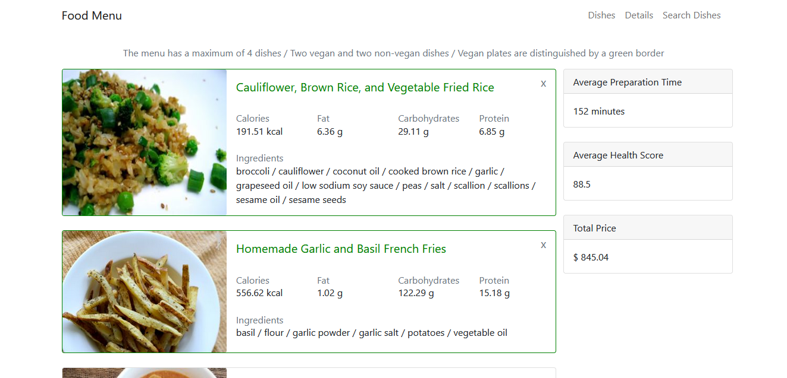

# Food Menu
Solución al challenge Frontend - React v2 de Alkemy.

Food Menu es una aplicación pensada para un hotel. Dicha aplicación permitirá crear una carta de opciones de menús y mostrar diferentes atributos a nivel individual de cada plato y del menú finalizado.

## Screenshot



## Construido con

- React js, react-router-dom, Babel y Webpack
- Redux Toolkit
- Bootstrap para los estilos y SweetAlert para las alertas
- Formik para la validación de formularios
- Axios para las peticiones a las APIs

## Implementación

Para correr la aplicación de forma local, basta con clonar el repositorio

```
git clone git@github.com:PabloTachella/food-menu.git
```

Luego, para instalar las dependencias necesarias ejecute el siguiente comando

```
npm install
```

Listo! Ahora puede montar un servidor local donde visualizar la app ejecutando

```
npm run start
```

o contruir su paquete para producción ejecutando

```
npm run build
```

**Nota: es necesario que cree un archivo .env con las variables de entorno especificadas en env.template, puede obtener sus credenciales en https://api.spoonacular.com**

**Actualmente la app fue desplegada a producción y para evitar el bloqueo de carga de contenido activo mixto debido a las peticiones de autenticación vía HTTP sin cifrar, se realizan las autenticaciones de forma local. Para obtener más información o modificar este comportamiento dirijase a ./src/utils/getData.js**

## Autor

- Website - [Pablo Tachella](https://pablotachella.github.io/)